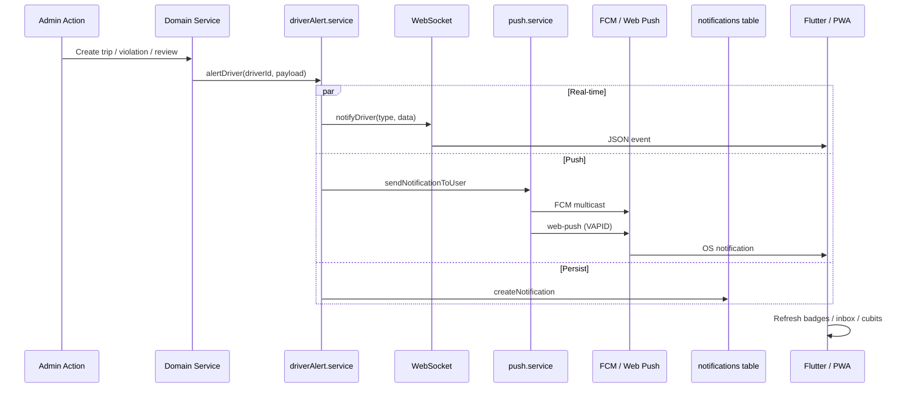

# Driver Alerts & Notifications

**Version:** 1.0  
**Author Role:** Solutions Architect  
**Date:** 2026-06-25  
**Status:** Approved  
**Input Artifacts:** `03-architecture.md` v1.4, `06-api-specification.md` v1.2  

---

## 1. Executive Summary

Drivers receive operational alerts through **three synchronized channels**:

| Channel | When it works | Implementation |
|---------|---------------|----------------|
| **Push notification** | App background / screen off | FCM (Flutter) + Web Push VAPID (PWA) |
| **WebSocket event** | App foreground, connected | `tracking.ws.js` → driver socket |
| **In-app notification** | Any time (inbox + badge) | PostgreSQL `notifications` table |

All admin-facing and system-initiated driver events flow through **`NotificationAdapter`** → **`driverAlert.service.js`**, which fans out to WebSocket, push, and persistent storage.

---

## 2. Architecture



### 2.1 Central alert service

**Facade:** `backend/src/services/notificationAdapter.service.js`  
**Implementation:** `backend/src/services/driverAlert.service.js`

Domain modules and notifiers call `NotificationAdapter.alertDriver()` — not push or WebSocket directly.

```javascript
await alertDriver(driverId, {
  type: 'trip_assigned',
  title: 'New Trip Assigned',
  body: 'Pick up at …',
  entityId: trip.id,
  wsPayload: { trip: { … } },
  persist: true,  // default
  push: true,       // default
});
```

**WebSocket-only** (no push/inbox spam for driver-initiated actions):

```javascript
notifyDriverWs(driverId, { type: 'expense_update', … });
```

### 2.2 Notifier modules

| Module | File | Events |
|--------|------|--------|
| Trips | `modules/trip/trip.notifier.js` | assigned, cancelled (admin), completed |
| Shifts | `modules/shift/shift.notifier.js` | activated, closed |
| Violations | `modules/violation/violation.notifier.js` | created |
| Expenses | `modules/expense/expense.service.js` | reviewed (approve/reject) |
| Damage | `modules/damage/damage.service.js` | update (admin review) |
| Identity | `modules/auth/auth.service.js` | identity_update |

---

## 3. Event Catalog

### 3.1 Full alert (push + persist + WebSocket)

| Event type | Trigger | Typical title |
|------------|---------|---------------|
| `trip_assigned` | Admin assigns trip | New Trip Assigned |
| `trip_cancelled` | Admin cancels trip | Trip Cancelled |
| `trip_completed` | Trip completed | Trip Completed (inbox only; push off) |
| `shift_activated` | Shift goes active | Shift Activated |
| `shift_closed` | Shift closed (driver or admin) | Shift Closed |
| `violation_created` | Admin records violation | Traffic Violation Recorded |
| `expense_reviewed` | Admin approves/rejects expense | Expense Approved / Rejected |
| `damage_update` | Admin reviews damage report | Damage Report Updated |
| `identity_update` | Admin approves/rejects identity | Identity Verified / Update |

### 3.2 WebSocket only (driver-initiated)

| Event type | Reason |
|------------|--------|
| `shift_started` | Driver started shift — already on shift screen |
| `trip_accepted` | Driver accepted — already on trip screen |
| `expense_update` | Driver submitted expense — UI already updated |

### 3.3 No driver alert (admin-only WebSocket)

Inspection create/upload/complete events notify **admins** only (`inspection.service.js`). Drivers do not receive push for their own inspection uploads.

---

## 4. Client Integration

### 4.1 Flutter mobile app

| Component | Path | Role |
|-----------|------|------|
| FCM registration | `mobile/lib/src/core/services/mobile_push_service.dart` | Token → `POST /push/register-device` |
| Android 13+ permission | Same file | `POST_NOTIFICATIONS` via `permission_handler` |
| Foreground FCM | Same file | Shows local notification via `LocalNotificationService` |
| WebSocket | `mobile/lib/src/core/services/websocket_service.dart` | Parses events, refreshes cubits |
| Event constants | `mobile/lib/src/core/services/driver_alert_events.dart` | Single source for types + messages |
| Local notifications | `mobile/lib/src/core/services/local_notification_service.dart` | Channel `sezar_driver_events` |
| Inbox UI | `mobile/lib/src/features/notifications/` | Lists persisted notifications |

**FCM channel ID** must match backend: `sezar_driver_events`.

### 4.2 Driver PWA (React)

| Component | Path | Role |
|-----------|------|------|
| Web Push subscribe | `frontend/src/hooks/usePushNotifications.js` | VAPID → `POST /push/subscribe` |
| WebSocket + toast | `frontend/src/hooks/useDriverTracking.js` | Sound + native notification |
| Badge counts | `frontend/src/hooks/useDriverBadges.js` | Tab badges |
| Notification inbox | `frontend/src/hooks/useNotificationBadge.js` | Unseen count |

---

## 5. API Endpoints

### Push registration

| Method | Endpoint | Body |
|--------|----------|------|
| `GET` | `/api/v1/push/vapid-key` | — |
| `POST` | `/api/v1/push/subscribe` | `{ subscription }` (PWA) |
| `POST` | `/api/v1/push/register-device` | `{ token, platform }` (FCM) |
| `POST` | `/api/v1/push/unregister-device` | `{ token }` |

### Notification inbox

| Method | Endpoint | Description |
|--------|----------|-------------|
| `GET` | `/api/v1/notifications` | Paginated list + `unseenCount` |
| `GET` | `/api/v1/notifications/unseen-count` | Badge counter |
| `PATCH` | `/api/v1/notifications/mark-all-read` | Clear badge |
| `PATCH` | `/api/v1/notifications/mark-read` | `{ ids: [] }` |

---

## 6. Database

**Migration:** `backend/prisma/migrations/20260625120000_add_notifications/migration.sql`

### notifications

| Column | Description |
|--------|-------------|
| `user_id` | Driver (or user) recipient |
| `title`, `body` | Display text |
| `type` | Event type (e.g. `trip_assigned`) |
| `entity_id` | Related trip/shift/violation ID |
| `is_read` | Inbox read state |

### device_push_tokens

FCM tokens for Flutter APK (`android` / `ios`).

### push_subscriptions

Web Push endpoints for PWA (VAPID keys in JSON).

See [04-database-schema.md](04-database-schema.md) §2.15–2.17.

---

## 7. Configuration

### Backend `.env`

```env
# Web Push (PWA)
VAPID_PUBLIC_KEY=…
VAPID_PRIVATE_KEY=…
VAPID_SUBJECT=mailto:support@example.com

# FCM (mobile)
FIREBASE_SERVICE_ACCOUNT_PATH=./secrets/firebase-service-account.json
# or FIREBASE_SERVICE_ACCOUNT_JSON={…}
```

See [mobile/docs/FCM_SETUP.md](../mobile/docs/FCM_SETUP.md).

---

## 8. Troubleshooting

| Symptom | Likely cause | Fix |
|---------|--------------|-----|
| No push on Android 13+ | `POST_NOTIFICATIONS` denied | Grant in system settings; app requests on init |
| Inbox empty but WS works | Missing `notifications` table | `npx prisma migrate deploy` |
| FCM silent | Firebase not configured | Set service account; check backend logs `[FCM]` |
| PWA no push | VAPID not subscribed | Driver must grant notification permission |
| Duplicate alerts | Driver-initiated event | Should use `notifyDriverWs` only — check notifier |

---

## 9. Testing

### Backend

```bash
cd backend && npm test
```

### Mobile unit (alert constants)

```bash
cd mobile && flutter test test/driver_alert_events_test.dart
```

### Android UI journeys (device + adb)

```bash
python3 mobile/test/journeys/run_journey.py mobile/test/journeys/driver_notifications_drawer.xml
```

---

## Change Log

| Version | Date | Change | Author |
|---------|------|--------|--------|
| 1.0 | 2026-06-25 | Initial document; unified driverAlert.service | Solutions Architect |
